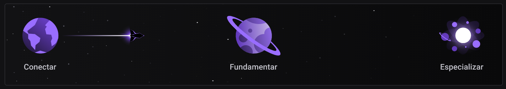

# Rocketseat - Discover

## Certificados

  
  
Código: b92aceba-9246-4c3c-ae13-f8e497e7adfc

 
  📙 <a href="/HTML/html.md"><strong>HTML</strong></a>&nbsp;&nbsp; | &nbsp;&nbsp;
  📘 <a href="/CSS/css.md"><strong>CSS</strong></a>&nbsp;&nbsp; | &nbsp;&nbsp;
  📒 <a href="/JavaScript/javascript.md"><strong>JavaScript</strong></a>&nbsp;&nbsp; | &nbsp;&nbsp;
  🕓 <a href="/Git/git.md"><strong>Git</strong></a>&nbsp;&nbsp; | &nbsp;&nbsp;
  💻 <a href="/node/node.md"><strong>NodeJS</strong></a>&nbsp;&nbsp; | &nbsp;&nbsp;
  📄 <a href="/node_EJS/EJS.md"><strong>EJS</strong></a>&nbsp;&nbsp; | &nbsp;&nbsp;
  💾 <a href="/SQL/sql.md"><strong>SQL</strong></a>

## Módulos

<!-- ❌✔️ -->

### 🚀 **Equipando sua nave**

1. ✔️ Ambiente dev de outro mundo
1. ✔️ Terminal, sua segunda casa

#

### 📚 **Guias estelares**

1. ✔️ Guia Estelar de Programação
1. ✔️ Guia Estelar de HTTP
1. ✔️ O Guia Estelar de HTML
1. ✔️ O Guia Estelar de CSS
1. ✔️ O Guia Estelar de JavaScript
1. ✔️ Guia Estelar de Git
1. ✔️ Guia Estelar de Github

#

### 👨🏽‍🚀 **Preparação de astronautas**

1. ✔️ (HTML) Formulários de outro planeta
1. ✔️ (HTML) HTML que faz sentido, para todos
1. ✔️ (HTML) Posso ver e ouvir o HTML
1. ✔️ (JS) Pilotando com a DOM
1. ✔️ (CSS) App bonito, até nos textos
1. ✔️ (CSS) Nem tudo são pixels
1. ✔️ (CSS) Nem só de classes ou ID's
1. ✔️ (CSS) Uma caixa dentro da outra
1. ✔️ (CSS) Agora sim, cores
1. ✔️ (CSS) Posicionando foguetes
1. ✔️ (CSS) Alinhando os planetas

#

### 🛰️ **Viajando ao espaço**

1. ✔️ NodeJS: O Motor da Nave
1. ✔️ NodeJS + EJS: HTML Inteligente
1. ✔️ SQL, a caixa preta da nossa nave

#

## Trilhas

<!-- ❌✔️ -->

### 🌎 Conectar (Carga horária: 2 horas)

1. ✔️ Guia Estelar de Programação
1. ✔️ Computador, Software e Hardware ✨
1. ✔️ Internet, Roteadores e Servidores ✨
1. ✔️ Sistemas Operacionais ✨
1. ✔️ Linguagem de Programação ✨
1. ✔️ Tipos de Aplicações WEB ✨

#

### 🪐 Fundamentar (Carga horária: 29 horas)

1. ✔️ Ambiente Dev
1. ✔️ Guia Estelar de HTML
1. ✔️ Guia Estelar de CSS
1. ✔️ Nem tudo são Pixels
1. ✔️ Uma caixa dentro da outra
1. ✔️ Agora sim, cores
1. ✔️ Posso ver e ouvir o HTML
1. ✔️ Posicionando foguetes
1. ✔️ App bonito, até nos textos
1. ✔️ Formulários de outro planeta
1. ✔️ Guia Estelar JavaScript
1. ✔️ HTML que faz sentido, para todos
1. ✔️ Nem só de classes ou IDs
1. ✔️ Alinhando os planetas
1. ✔️ Pilotando com a DOM
1. ✔️ Terminal
1. ✔️ NodeJS
1. ✔️ Node + EJS
1. ✔️ SQL
1. ✔️ Estruturas de Dados  ✨
1. ✔️ Programação Orientada a Objetos ✨
1. ✔️ Programação Funcional ✨
1. ✔️ Guia Estelar de Git
1. ✔️ Guia estelar de Github
1. ✔️ Guia Estelar de HTTP

#

### 🌌 Especializar (Carga horária: 7 horas)

1. ❌ Javascript Assíncrono e Promises
1. ❌ Trabalhando com APIs
1. ❌ Fundamentos de ReactJS
1. ❌ Fundamentos de Typescript
1. ❌ Github para times
1. ❌ Transition e Animation
1. ❌ SQL Avançado